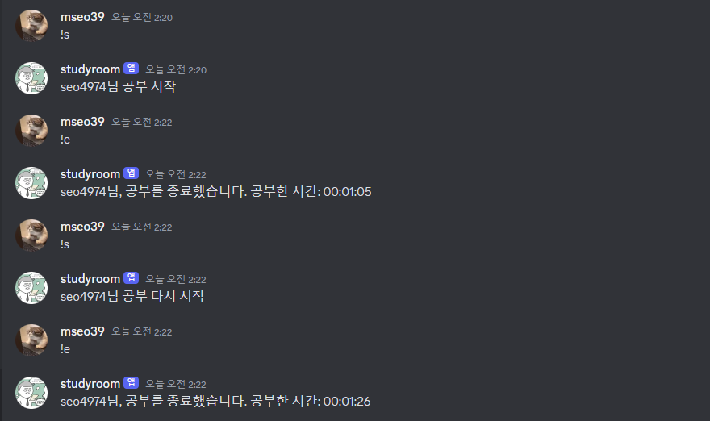
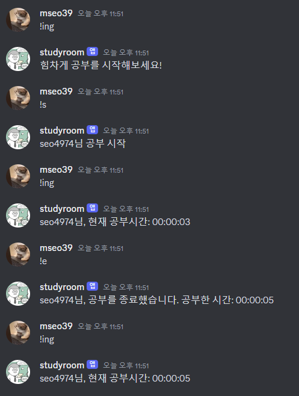

### 2024-04-12

1. intents 에러

   ```TypeError: __init__() missing 1 required keyword-only arguments: 'intents'```
 
    해결: [사이트](https://devwithpug.github.io/python/sabot-2/#2-intents%EC%9D%98-%ED%95%84%EC%9A%94%EC%84%B1)

2. Privileged Gateway Intents 에러
    ```
    discord.errors.PrivilegedIntentsRequired: Shard ID None is requesting privileged intents that have not been explicitly enabled in the developer portal. It is recommended to go to https://discord.com/developers/applications/ and explicitly enable the privileged intents within your application's page. If this is not possible, then consider disabling the privileged intents instead.
    ```
    해결: Privileged Gateway Intents 관련 설정을 모두 허용

3. 오늘의 결과

   메시지 띄우기,, 귀엽다,,
   
   

### 2024-04-23

1. 총 시간을 어떻게 누적시키지...? 하다가 초단위로 하면 되겠다고 떠올라,, 초로 누적해줌..ㅎㅎ


### 2024-04-24

1. 공부 시작 전, 공부 시작중, 공부 중단 후 3가지 경우에 현재 공부 시간을 알고 싶을 때 사용하는 ing를 만들어줌


2. 시분초 계산 코드가 중복되어 하나의 함수로 만들어줌